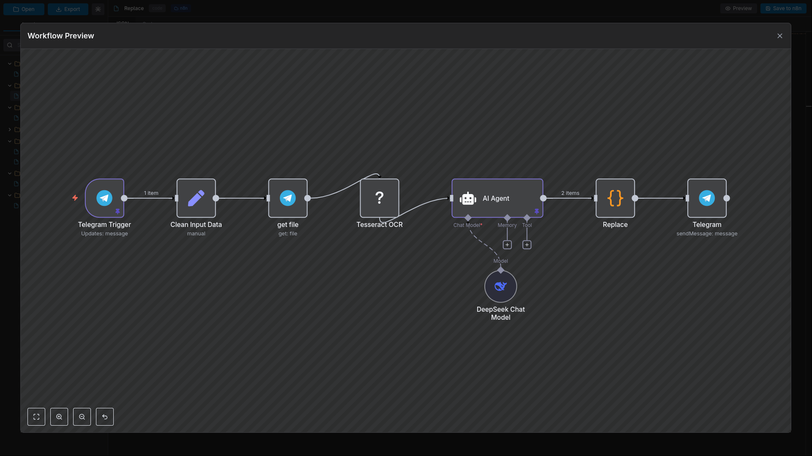

# N8N Code Editor

<div align="center">

**Main Editor**


**Preview**



**A powerful desktop editor for n8n workflows with live API integration**

[](https://opensource.org/licenses/MIT)
[](https://www.electronjs.org/)
[](https://reactjs.org/)

[Features](#features) • [Installation](#installation) • [Usage](#usage) • [Build](#build)

</div>

---

## Why N8N Code Editor?

Traditional workflow editing can be cumbersome when you need to make quick changes to node configurations or debug complex JavaScript code. N8N Code Editor provides a **developer-friendly environment** with:

- **Direct API Integration** - Connect to your n8n instance and edit workflows in real-time
- **Professional Code Editor** - Monaco Editor (VS Code's editor) with full IntelliSense
- **Visual Preview** - See your workflow structure with the official n8n web component
- **Faster Navigation** - Tree view and search make finding nodes instant
- **Workflow Management** - Import, export, and organize workflows effortlessly

Perfect for developers who prefer working with code and need a fast, lightweight alternative to the web interface.

---

## Features

### Core Functionality
- 🔗 **Live N8N Integration** - Connect directly to your n8n instance via API
- 🌳 **Smart Tree View** - Nodes organized by type with search and filtering
- 💻 **Monaco Editor** - Professional code editor with syntax highlighting for JSON and JavaScript
- 👁️ **Visual Preview** - Full workflow visualization with nodes, connections, and icons
- 🎯 **Dedicated Code Tab** - Special editor for JavaScript in code nodes with proper formatting
- 🔍 **Powerful Search** - Find nodes instantly by name, type, or category

### Workflow Management
- 📂 **Drag & Drop** - Drop JSON files directly into the app
- 💾 **Auto-Save** - Save with Cmd/Ctrl+S keyboard shortcut
- ⚠️ **Unsaved Changes** - Visual indicator and prompts before closing
- 📤 **Export/Import** - Easy workflow backup and sharing
- 🔄 **Real-time Sync** - Changes sync instantly to your n8n instance

### Developer Experience
- ⚡ **Lightweight** - Fast startup and minimal resource usage
- 🎨 **Dark Theme** - Easy on the eyes for long coding sessions
- ⌨️ **Keyboard Shortcuts** - Efficient workflow navigation
- 🔧 **Cross-Platform** - Works on macOS, Windows, and Linux

---

## Installation

### Prerequisites
- Node.js 16 or higher
- npm 7 or higher

### Setup

```bash
# Clone the repository
git clone https://github.com/sudwe3/n8n-code.git

# Navigate to the project
cd n8n-code

# Install dependencies
npm install
```

---

## Usage

### Development Mode

Run the app in development mode with hot-reload:

```bash
npm run electron:dev
```

### Opening Workflows

**Method 1: From Local File**
1. Click the "Open" button
2. Select a `.json` workflow file

**Method 2: Drag & Drop**
- Simply drag and drop a `.json` file into the window

**Method 3: From N8N Instance**
1. Click the settings icon (⚙️)
2. Enter your n8n base URL and API key
3. Click "Connect"
4. Switch to the "n8n" tab to see your workflows
5. Click any workflow to open it

### Editing Workflows

**Tree Navigation**
- Browse nodes organized by category
- Use the search bar to filter nodes
- Click any node to view/edit its configuration

**Editing**
- **JSON Tab**: Full node configuration in JSON format
- **Code Tab**: Dedicated JavaScript editor for code nodes
- Press `Cmd/Ctrl+S` to save changes
- Orange dot (●) indicates unsaved changes

**Visual Preview**
- Click the "Preview" button to see the workflow visualization
- Includes all node types, connections, and proper n8n icons

### N8N API Configuration

To connect to your n8n instance:

1. Go to your n8n instance → Settings → n8n API
2. Click "Create an API key"
3. Copy the API key
4. In N8N Code Editor, click the settings icon
5. Enter:
   - **Base URL**: Your n8n instance URL (e.g., `https://your-n8n.com`)
   - **API Key**: The key you copied
6. Click "Connect"

---

## Build

Build the application for distribution:

```bash
# Build for your current platform
npm run build

# Or build for specific platforms
npm run build:win    # Windows
npm run build:linux  # Linux
npm run build:all    # All platforms
```

Build outputs will be in the `dist/` folder.

**Supported Formats:**
- **macOS**: DMG and ZIP
- **Windows**: NSIS installer and portable
- **Linux**: AppImage and DEB

---

## Technologies

| Technology | Purpose |
|------------|---------|
| [Electron 28](https://www.electronjs.org/) | Desktop application framework |
| [React 18](https://reactjs.org/) | UI framework |
| [Monaco Editor](https://microsoft.github.io/monaco-editor/) | Code editor (VS Code's editor) |
| [Tailwind CSS](https://tailwindcss.com/) | Styling |
| [Vite](https://vitejs.dev/) | Build tool |
| [N8N API](https://docs.n8n.io/api/) | Workflow integration |

---

## Roadmap

- [ ] Multi-workflow tabs
- [ ] Workflow execution from editor
- [ ] Node templates library
- [ ] Git integration for version control
- [ ] Collaborative editing
- [ ] Workflow debugging tools

---

## Contributing

Contributions are welcome! Please feel free to submit a Pull Request.

1. Fork the project
2. Create your feature branch (`git checkout -b feature/AmazingFeature`)
3. Commit your changes (`git commit -m 'Add some AmazingFeature'`)
4. Push to the branch (`git push origin feature/AmazingFeature`)
5. Open a Pull Request

---

## License

This project is licensed under the MIT License - see the [LICENSE](LICENSE) file for details.

---

## Acknowledgments

Built for editing [n8n](https://n8n.io) workflows. N8N is a powerful workflow automation tool that this editor complements perfectly.

---

<div align="center">

**Made with ❤️ for the n8n community**

</div>
