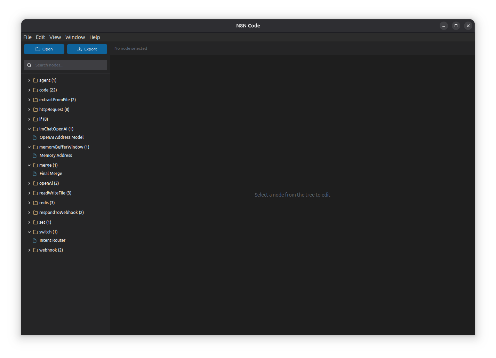

# N8N Code Editor

A lightweight desktop editor for n8n workflow JSON files, built with Electron and Monaco Editor.



## Features

- **Tree View**: Browse workflow nodes organized by type
- **Monaco Editor**: Full syntax highlighting for JSON and JavaScript
- **Code Tab**: Dedicated JavaScript editor for code nodes with proper formatting
- **Drag & Drop**: Drop JSON files directly into the app
- **Keyboard Shortcuts**: Save with Cmd/Ctrl+S
- **Unsaved Changes Warning**: Prompts before closing with unsaved work
- **Export/Import**: Easy workflow management

## Installation

```bash
git clone https://github.com/sudwe3/n8n-code.git
cd n8n-code
npm install
```

## Usage

### Development Mode

```bash
npm start
```

### Build for Mac

```bash
npm run build
```

The `.dmg` and `.zip` files will be in the `dist/` folder.

### Opening Workflows

1. Click "Open" button
2. Drag and drop a `.json` file into the window
3. Double-click a `.json` file (after building the app)

### Editing

- Click on any node in the tree to edit its JSON
- For code nodes, use the "Code" tab for a better JavaScript editing experience
- Save changes with the "Save" button or Cmd/Ctrl+S

## Project Structure

```
n8n-code/
├── main.js           # Electron main process
├── preload.js        # Preload script for IPC
├── package.json      # Dependencies and scripts
├── src/
│   ├── index.html    # Main HTML file
│   └── index.js      # React app with Monaco Editor
└── public/           # Static assets (might be empty)
```

## Requirements

- Node.js 16+
- npm 7+

## Technologies

- Electron 28
- React 18
- Monaco Editor
- Tailwind CSS

## License

MIT

## Contributing

Pull requests are welcome. For major changes, please open an issue first.

## Author

Your Name

## Acknowledgments

Built for editing [n8n](https://n8n.io) workflows.